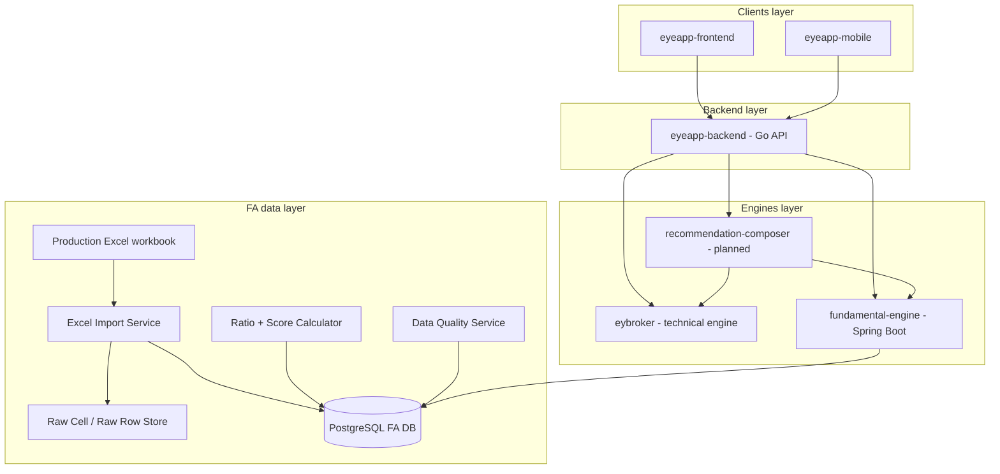
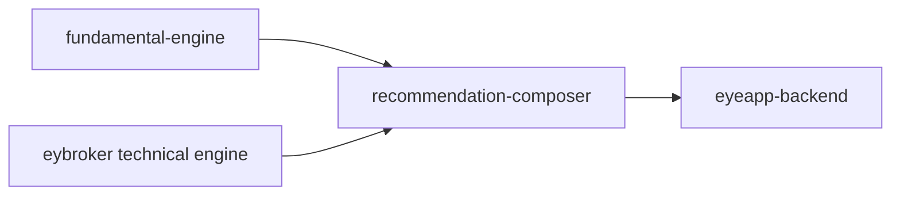

# fundamental-engine — Agent Instructions & Initial Architecture

## 0. Mission

`fundamental-engine` is a new Spring Boot service in the `eyelanding / eyeapp` ecosystem.

Its mission is to convert real production financial statement data of Vietnamese listed companies into structured Fundamental Analysis (FA) data, ratios, scores, screeners, and later investment recommendation inputs.

Phase 1 must focus on:

1. Importing the provided Excel workbook as quickly and safely as possible.
2. Normalizing financial data into database tables.
3. Calculating basic FA metrics and ratios.
4. Producing rule-based FA scores.
5. Exposing internal APIs for `eyeapp-backend` to build ticker dashboard and screener pages.

Do not build machine learning prediction, trading automation, or final buy/sell advice in Phase 1.

---

## 1. Business Context

The broader system currently has:

```text
Marketing layer:
  eyelanding - Next.js marketing + docs

Clients layer:
  eyeapp-frontend - React + Vite SPA
  eyeapp-mobile - Expo / React Native

Backend layer:
  eyeapp-backend - Go API, BFF, auth, aggregation
  eyeapp-payment - planned

Engines layer:
  eybroker - technical signals & positions engine
  fundamental-engine - this new module
```

`fundamental-engine` must be treated as an upstream engine, similar to `eybroker`.

The service should not be directly called by frontend/mobile. Frontend/mobile should call `eyeapp-backend`, and `eyeapp-backend` should call `fundamental-engine` via internal APIs.

---

## 2. Scope of Phase 1

### 2.1 Must-have

| Feature | Description |
|---|---|
| Excel import | Import the production sample Excel file containing Q1.2026 and historical financial data. |
| Import batch tracking | Every import must create a batch with checksum, status, counts, warnings, and errors. |
| Sheet mapping | Read key sheets such as revenue, NPAT, gross profit, yearly NPAT, EPS diluted, shares outstanding, stock price, P/B, company list. |
| Normalized FA metrics | Store values as metric facts by ticker, period, metric code, and import batch. |
| Data quality | Distinguish `OK`, `MISSING`, `NOT_REPORTED`, `NOT_APPLICABLE`, `FORMULA_ERROR`, `SUSPICIOUS`. Never silently convert invalid data to `0`. |
| Ratio calculation | Calculate YoY, QoQ, margins, market cap, P/E if enough data exists. |
| FA score | Rule-based score from 0 to 100. |
| Ticker APIs | Get overview, financials, ratios, score, quality report for one ticker. |
| Screener API | Search tickers by FA score, growth, valuation, exchange, industry, and quality status. |
| Database migration | Use Liquibase for all schema creation. |

### 2.2 Should-have

| Feature | Description |
|---|---|
| Import preview | Validate workbook and show detected sheets before committing import. |
| Industry benchmark | Median P/B, P/E, margin by industry if industry data exists. |
| AI-ready summary payload | Structured facts that later AI service can summarize without hallucination. |
| Cache | Cache read-heavy dashboard/screener responses. |

### 2.3 Out of scope for Phase 1

| Out of scope | Reason |
|---|---|
| ML price prediction | Too early and hard to explain. |
| Realtime streaming | FA data is periodic, not realtime. |
| Direct buy/sell recommendation | Requires combined FA + TA + legal wording. |
| Complex bank/securities/insurance models | Mark as sector-specific partial analysis first. |
| Automatic crawling from public sites | Start with the provided production Excel sample. |

---

## 3. Technology Decisions

### 3.1 Default stack

Use Spring Boot as the main service framework.

Recommended default for a new standalone project:

```text
Java: 21
Spring Boot: 3.x
Build: Maven
Database: PostgreSQL
Migration: Liquibase
ORM: Spring Data JPA
Excel parsing: Apache POI
Validation: Jakarta Validation
API docs: springdoc-openapi
Observability: Actuator + structured logging
Tests: JUnit 5 + Testcontainers where practical
```

If the actual runtime environment only supports Java 17, adapt to Java 17. Do not downgrade below Java 17 unless explicitly required.

### 3.2 Required Maven dependencies

At minimum:

```xml
<dependencies>
    <dependency>
        <groupId>org.springframework.boot</groupId>
        <artifactId>spring-boot-starter-web</artifactId>
    </dependency>
    <dependency>
        <groupId>org.springframework.boot</groupId>
        <artifactId>spring-boot-starter-validation</artifactId>
    </dependency>
    <dependency>
        <groupId>org.springframework.boot</groupId>
        <artifactId>spring-boot-starter-data-jpa</artifactId>
    </dependency>
    <dependency>
        <groupId>org.springframework.boot</groupId>
        <artifactId>spring-boot-starter-actuator</artifactId>
    </dependency>
    <dependency>
        <groupId>org.liquibase</groupId>
        <artifactId>liquibase-core</artifactId>
    </dependency>
    <dependency>
        <groupId>org.postgresql</groupId>
        <artifactId>postgresql</artifactId>
        <scope>runtime</scope>
    </dependency>
    <dependency>
        <groupId>org.apache.poi</groupId>
        <artifactId>poi-ooxml</artifactId>
    </dependency>
    <dependency>
        <groupId>org.springdoc</groupId>
        <artifactId>springdoc-openapi-starter-webmvc-ui</artifactId>
    </dependency>
</dependencies>
```

Optional but useful:

```xml
<dependency>
    <groupId>org.projectlombok</groupId>
    <artifactId>lombok</artifactId>
    <optional>true</optional>
</dependency>
<dependency>
    <groupId>org.testcontainers</groupId>
    <artifactId>postgresql</artifactId>
    <scope>test</scope>
</dependency>
```

---

## 4. Architecture Principles

### 4.1 Service responsibility

`fundamental-engine` owns FA data and FA logic only.

It should answer questions like:

```text
How healthy is this business fundamentally?
How fast is revenue/profit growing?
Is valuation high or low?
Is the data complete and reliable?
What is the FA score?
```

It should not answer final trading questions like:

```text
Should the user buy now?
Where should the user enter?
What is the stop loss?
```

Those questions belong to `recommendation-composer`, which will later combine `fundamental-engine` and `eybroker` outputs.

### 4.2 Clean layering

Use this layering strictly:

```text
controller  -> application service -> domain service -> repository / infrastructure
```

Rules:

- Controllers must be thin.
- Business rules must be in service/domain classes.
- Excel parsing must be isolated under infrastructure/import package.
- Database access must be isolated under repository layer.
- DTOs must not leak JPA entities.
- Financial calculations must be deterministic and unit tested.

### 4.3 Import safety

Importing Excel is a data mutation operation. It must be idempotent by file checksum and batch-aware.

Rules:

- Compute SHA-256 checksum for each uploaded file.
- Create one `fa_import_batch` per import.
- Do not overwrite previous successful imports blindly.
- New import should create a new batch and new metric versions.
- Read APIs should default to latest successful batch unless `batchId` is provided.
- If an import partially fails, mark `PARTIAL_SUCCESS` and expose quality report.
- Do not treat blank/error cells as zero unless the source explicitly means zero.

---

## 5. High-level Architecture



---

## 6. Internal Components

```text
fundamental-engine
├── api
│   ├── controller
│   ├── dto
│   └── error
├── application
│   ├── importbatch
│   ├── ticker
│   ├── screener
│   ├── ratio
│   └── score
├── domain
│   ├── company
│   ├── metric
│   ├── ratio
│   ├── score
│   └── quality
├── infrastructure
│   ├── excel
│   ├── persistence
│   ├── config
│   └── clock
└── common
    ├── money
    ├── number
    ├── period
    └── text
```

### 6.1 Package layout

Recommended Java package:

```text
com.eyelanding.fundamentalengine
```

Recommended folder structure:

```text
src/main/java/com/eyelanding/fundamentalengine
├── FundamentalEngineApplication.java
├── api
│   ├── controller
│   │   ├── FaImportController.java
│   │   ├── TickerFaController.java
│   │   └── FaScreenerController.java
│   ├── dto
│   └── error
├── application
│   ├── importbatch
│   │   ├── FaImportBatchService.java
│   │   ├── ExcelImportOrchestrator.java
│   │   └── ImportBatchQueryService.java
│   ├── ticker
│   │   └── TickerFaQueryService.java
│   ├── screener
│   │   └── FaScreenerService.java
│   ├── ratio
│   │   └── RatioCalculationService.java
│   └── score
│       └── FaScoreCalculationService.java
├── domain
│   ├── MetricCode.java
│   ├── RatioCode.java
│   ├── PeriodCode.java
│   ├── QualityStatus.java
│   ├── ImportStatus.java
│   └── SectorModel.java
├── infrastructure
│   ├── excel
│   │   ├── ExcelWorkbookReader.java
│   │   ├── ExcelSheetAliasResolver.java
│   │   ├── FinancialSheetParser.java
│   │   ├── CompanySheetParser.java
│   │   └── ExcelCellValueExtractor.java
│   └── persistence
│       ├── entity
│       └── repository
└── common
    ├── TextNormalizer.java
    ├── BigDecimalUtils.java
    └── FinancialPeriodParser.java
```

---

## 7. Excel Workbook Contract for MVP

The provided workbook is a real production sample for Q1.2026 and historical periods. It may contain missing values, formulas, and Excel formula errors. Treat the workbook as a data source, not as a clean database.

### 7.1 Expected sheets

Implement sheet matching by alias, not by exact name only. Normalize Vietnamese accents, casing, and extra spaces.

| Logical sheet | Possible Excel sheet name |
|---|---|
| `COMPANY_LIST` | `Tất cả CP`, `Tat ca CP`, `All Stocks` |
| `FILTER` | `Lọc`, `Loc` |
| `REVENUE` | `Doanh thu` |
| `NPAT` | `LNST` |
| `GROSS_PROFIT` | `LNG` |
| `NPAT_YEARLY` | `LNST năm`, `LNST nam` |
| `EPS_DILUTED` | `EPS pha loãng`, `EPS pha loang` |
| `SHARES_OUTSTANDING` | `SLCP lưu hành`, `SLCP luu hanh` |
| `STOCK_PRICE` | `GIÁ CP`, `GIA CP` |
| `PB` | `P.B`, `PB` |
| `TICKER_LOOKUP` | `Tìm nhanh CP`, `Tim nhanh CP` |

### 7.2 Import target metrics

Phase 1 should import these metrics:

| Metric code | Source logical sheet | Period type | Unit |
|---|---|---|---|
| `REVENUE` | `REVENUE` | `QUARTER` | `VND` or source unit |
| `NPAT` | `NPAT` | `QUARTER` | `VND` or source unit |
| `GROSS_PROFIT` | `GROSS_PROFIT` | `QUARTER` | `VND` or source unit |
| `NPAT_YEARLY` | `NPAT_YEARLY` | `YEAR` | `VND` or source unit |
| `EPS_DILUTED` | `EPS_DILUTED` | `QUARTER` or `TTM` depending source header |
| `SHARES_OUTSTANDING` | `SHARES_OUTSTANDING` | `POINT_IN_TIME` | `SHARE` |
| `CLOSE_PRICE` | `STOCK_PRICE` | `POINT_IN_TIME` | `VND` |
| `PB` | `PB` | `POINT_IN_TIME` | `RATIO` |

### 7.3 Parsing rules

1. Detect header row by finding ticker/company columns and period columns.
2. Detect ticker column by common names: `Mã`, `Ma`, `Ticker`, `Code`, `Mã CP`.
3. Detect exchange column by common names: `Sàn`, `San`, `Exchange`.
4. Detect industry columns if present: `Ngành`, `Nganh`, `Industry`, `ICB`, `Level`.
5. Period headers may look like `Q1.2026`, `Q1.26`, `2026Q1`, `2025`, or similar. Normalize to:
   - `2026Q1` for quarterly.
   - `2025` for yearly.
6. Numeric values may be stored as numeric cells, string cells, formula cells, or error cells.
7. For formula cells, read cached formula result if available. Also record that the source was formula-based.
8. For formula errors such as `#DIV/0!`, `#N/A`, `#REF!`, store quality issue. Do not convert to zero.
9. Blank cells should become `MISSING`, unless business rule says `NOT_REPORTED`.
10. For sectors where a metric does not apply, store or report `NOT_APPLICABLE`.

### 7.4 Do not overfit to the first file

The MVP uses the provided workbook, but the importer should be flexible enough to handle later quarterly workbooks with similar structure.

---

## 8. Domain Enums

### 8.1 `MetricCode`

```java
public enum MetricCode {
    REVENUE,
    NPAT,
    GROSS_PROFIT,
    NPAT_YEARLY,
    EPS_DILUTED,
    SHARES_OUTSTANDING,
    CLOSE_PRICE,
    PB
}
```

### 8.2 `RatioCode`

```java
public enum RatioCode {
    REVENUE_YOY,
    NPAT_YOY,
    REVENUE_QOQ,
    NPAT_QOQ,
    GROSS_MARGIN,
    NET_MARGIN,
    MARKET_CAP,
    EPS_TTM,
    PE_TTM,
    PB,
    POSITIVE_NPAT_LAST_4Q,
    PROFIT_TURNAROUND_FLAG
}
```

### 8.3 `QualityStatus`

```java
public enum QualityStatus {
    OK,
    MISSING,
    NOT_REPORTED,
    NOT_APPLICABLE,
    FORMULA_ERROR,
    SUSPICIOUS,
    ESTIMATED
}
```

### 8.4 `ImportStatus`

```java
public enum ImportStatus {
    PENDING,
    PROCESSING,
    SUCCESS,
    PARTIAL_SUCCESS,
    FAILED,
    CANCELLED
}
```

### 8.5 `SectorModel`

```java
public enum SectorModel {
    GENERAL,
    BANK,
    SECURITIES,
    INSURANCE,
    REAL_ESTATE,
    UNKNOWN
}
```

---

## 9. Initial Database Design

Use PostgreSQL.

All schema changes must be implemented using Liquibase.

Recommended schema name:

```text
fa
```

If the project uses default `public`, keep table names prefixed with `fa_`.

### 9.1 `dim_company`

Stores company identity and sector metadata.

```sql
create table dim_company (
    id bigserial primary key,
    ticker varchar(20) not null unique,
    company_name text,
    exchange varchar(20),
    industry_level_1 text,
    industry_level_2 text,
    industry_level_3 text,
    sector_model varchar(30) not null default 'UNKNOWN',
    is_active boolean not null default true,
    created_at timestamp not null default now(),
    updated_at timestamp not null default now()
);

create index idx_dim_company_exchange on dim_company(exchange);
create index idx_dim_company_sector_model on dim_company(sector_model);
```

### 9.2 `fa_import_batch`

Tracks each Excel import.

```sql
create table fa_import_batch (
    id bigserial primary key,
    source_type varchar(50) not null,
    source_file_name text not null,
    source_file_checksum varchar(128) not null,
    report_period varchar(20),
    status varchar(30) not null,
    total_rows integer default 0,
    success_rows integer default 0,
    warning_rows integer default 0,
    error_rows integer default 0,
    imported_by varchar(100),
    started_at timestamp,
    finished_at timestamp,
    error_message text,
    created_at timestamp not null default now(),
    updated_at timestamp not null default now()
);

create index idx_fa_import_batch_status on fa_import_batch(status);
create index idx_fa_import_batch_checksum on fa_import_batch(source_file_checksum);
create index idx_fa_import_batch_report_period on fa_import_batch(report_period);
```

Do not enforce unique checksum initially. Same file may need re-import during development. Later, add a business rule to prevent duplicate successful imports if needed.

### 9.3 `fa_raw_cell`

Stores optional raw cell-level evidence for traceability. This is useful for debugging import issues.

```sql
create table fa_raw_cell (
    id bigserial primary key,
    import_batch_id bigint not null references fa_import_batch(id),
    sheet_name varchar(200) not null,
    cell_ref varchar(30) not null,
    row_index integer not null,
    col_index integer not null,
    raw_text text,
    numeric_value numeric(30, 6),
    formula_text text,
    cell_type varchar(30),
    error_code varchar(50),
    created_at timestamp not null default now()
);

create index idx_fa_raw_cell_batch_sheet on fa_raw_cell(import_batch_id, sheet_name);
create index idx_fa_raw_cell_ref on fa_raw_cell(import_batch_id, sheet_name, cell_ref);
```

For MVP speed, this table can be populated only for problematic rows/cells. Do not store huge raw volume if not necessary.

### 9.4 `fa_financial_metric`

Main fact table for raw normalized financial metrics.

```sql
create table fa_financial_metric (
    id bigserial primary key,
    ticker varchar(20) not null,
    period_type varchar(30) not null,
    period_code varchar(20) not null,
    metric_code varchar(50) not null,
    metric_value numeric(30, 6),
    unit varchar(30),
    currency varchar(10),
    quality_status varchar(30) not null default 'OK',
    quality_note text,
    source_sheet varchar(200),
    source_cell varchar(30),
    import_batch_id bigint not null references fa_import_batch(id),
    created_at timestamp not null default now(),
    updated_at timestamp not null default now(),
    unique(ticker, period_type, period_code, metric_code, import_batch_id)
);

create index idx_fa_metric_ticker_period on fa_financial_metric(ticker, period_code);
create index idx_fa_metric_metric_period on fa_financial_metric(metric_code, period_code);
create index idx_fa_metric_batch on fa_financial_metric(import_batch_id);
create index idx_fa_metric_quality on fa_financial_metric(quality_status);
```

### 9.5 `fa_financial_ratio`

Stores calculated ratios.

```sql
create table fa_financial_ratio (
    id bigserial primary key,
    ticker varchar(20) not null,
    period_code varchar(20) not null,
    ratio_code varchar(50) not null,
    ratio_value numeric(30, 8),
    quality_status varchar(30) not null default 'OK',
    quality_note text,
    calculation_version varchar(50) not null,
    import_batch_id bigint not null references fa_import_batch(id),
    created_at timestamp not null default now(),
    updated_at timestamp not null default now(),
    unique(ticker, period_code, ratio_code, calculation_version, import_batch_id)
);

create index idx_fa_ratio_ticker_period on fa_financial_ratio(ticker, period_code);
create index idx_fa_ratio_code_period on fa_financial_ratio(ratio_code, period_code);
create index idx_fa_ratio_batch on fa_financial_ratio(import_batch_id);
```

### 9.6 `fa_score_snapshot`

Stores rule-based FA scores.

```sql
create table fa_score_snapshot (
    id bigserial primary key,
    ticker varchar(20) not null,
    period_code varchar(20) not null,
    growth_score numeric(10, 2),
    profitability_score numeric(10, 2),
    valuation_score numeric(10, 2),
    stability_score numeric(10, 2),
    data_quality_score numeric(10, 2),
    overall_score numeric(10, 2),
    rating varchar(30),
    explanation text,
    calculation_version varchar(50) not null,
    import_batch_id bigint not null references fa_import_batch(id),
    created_at timestamp not null default now(),
    unique(ticker, period_code, calculation_version, import_batch_id)
);

create index idx_fa_score_ticker_period on fa_score_snapshot(ticker, period_code);
create index idx_fa_score_overall on fa_score_snapshot(period_code, overall_score desc);
create index idx_fa_score_rating on fa_score_snapshot(period_code, rating);
```

### 9.7 `fa_data_quality_issue`

Stores quality issues found during import and calculation.

```sql
create table fa_data_quality_issue (
    id bigserial primary key,
    import_batch_id bigint not null references fa_import_batch(id),
    ticker varchar(20),
    period_code varchar(20),
    metric_code varchar(50),
    issue_type varchar(50) not null,
    severity varchar(20) not null,
    source_sheet varchar(200),
    source_cell varchar(30),
    message text not null,
    created_at timestamp not null default now()
);

create index idx_fa_quality_batch on fa_data_quality_issue(import_batch_id);
create index idx_fa_quality_ticker on fa_data_quality_issue(ticker);
create index idx_fa_quality_severity on fa_data_quality_issue(severity);
```

---

## 10. Liquibase Initial Changelog

Create:

```text
src/main/resources/db/changelog/db.changelog-master.yaml
src/main/resources/db/changelog/changes/001-create-fa-core-tables.yaml
```

`db.changelog-master.yaml`:

```yaml
databaseChangeLog:
  - include:
      file: db/changelog/changes/001-create-fa-core-tables.yaml
```

For speed, the first implementation may use Liquibase `sql` blocks. Later refactor to typed YAML changesets if desired.

Rules:

- Do not use destructive changes in later migrations without explicit approval.
- Do not modify an already-applied changeset. Add a new changeset instead.
- All indexes must be named.
- All enum-like fields are strings in DB for flexibility during MVP.

---

## 11. API Design

All APIs are internal for Phase 1.

Base path:

```text
/internal/fa
```

### 11.1 Upload/import Excel

```http
POST /internal/fa/import-batches/excel
Content-Type: multipart/form-data
```

Request parts:

```text
file: .xlsx
reportPeriod: optional, e.g. 2026Q1
importedBy: optional
mode: optional, default AS_NEW_BATCH
```

Response:

```json
{
  "batchId": 1001,
  "status": "PROCESSING",
  "sourceFileName": "TVI - File KQKD Q1.2026.xlsx",
  "sourceFileChecksum": "sha256..."
}
```

Implementation note:

For the fastest MVP, the import can run synchronously first and return final status. But design the API DTO so it can later run asynchronously.

### 11.2 Get import batch

```http
GET /internal/fa/import-batches/{batchId}
```

Response:

```json
{
  "batchId": 1001,
  "status": "SUCCESS",
  "reportPeriod": "2026Q1",
  "totalRows": 1607,
  "successRows": 1540,
  "warningRows": 67,
  "errorRows": 0,
  "startedAt": "2026-06-29T10:00:00",
  "finishedAt": "2026-06-29T10:03:00"
}
```

### 11.3 Get quality report

```http
GET /internal/fa/import-batches/{batchId}/quality-report
```

Query params:

```text
severity: optional
limit: optional default 200
```

Response:

```json
{
  "batchId": 1001,
  "summary": {
    "ERROR": 0,
    "WARN": 67,
    "INFO": 120
  },
  "issues": [
    {
      "ticker": "ABC",
      "period": "2026Q1",
      "metric": "REVENUE",
      "issueType": "MISSING",
      "severity": "WARN",
      "message": "Revenue is missing"
    }
  ]
}
```

### 11.4 Ticker overview

```http
GET /internal/fa/tickers/{ticker}/overview
```

Query params:

```text
period: optional, default latest report period
batchId: optional, default latest successful batch
```

Response:

```json
{
  "ticker": "HPG",
  "companyName": "Hoa Phat Group",
  "exchange": "HOSE",
  "industry": "Steel",
  "period": "2026Q1",
  "price": 28500,
  "pb": 1.8,
  "peTtm": 12.4,
  "marketCap": 170000000000000,
  "faScore": 82.5,
  "rating": "STRONG_FA",
  "dataQuality": "OK",
  "highlights": [
    "Revenue and NPAT improved year over year",
    "Profitability is positive in recent quarters"
  ],
  "warnings": [
    "Cash flow data is not available in Phase 1"
  ]
}
```

### 11.5 Ticker financials

```http
GET /internal/fa/tickers/{ticker}/financials
```

Query params:

```text
periodType: QUARTER | YEAR
metrics: optional comma-separated metric codes
batchId: optional
```

Response:

```json
{
  "ticker": "HPG",
  "periodType": "QUARTER",
  "items": [
    {
      "period": "2026Q1",
      "revenue": 52901000000000,
      "grossProfit": 8359000000000,
      "npat": 8994000000000,
      "epsDiluted": 1500,
      "qualityStatus": "OK"
    }
  ]
}
```

### 11.6 Ticker ratios

```http
GET /internal/fa/tickers/{ticker}/ratios
```

Query params:

```text
period: optional
batchId: optional
```

Response:

```json
{
  "ticker": "HPG",
  "period": "2026Q1",
  "ratios": {
    "revenueYoy": 0.406,
    "npatYoy": 1.689,
    "grossMargin": 0.158,
    "netMargin": 0.17,
    "marketCap": 170000000000000,
    "peTtm": 12.4,
    "pb": 1.8
  }
}
```

### 11.7 Ticker FA score

```http
GET /internal/fa/tickers/{ticker}/score
```

Response:

```json
{
  "ticker": "HPG",
  "period": "2026Q1",
  "overallScore": 82.5,
  "rating": "STRONG_FA",
  "components": {
    "growth": 28,
    "profitability": 22,
    "valuation": 17,
    "stability": 10,
    "dataQuality": 5.5
  },
  "explanations": [
    "NPAT increased strongly year over year",
    "Revenue growth is positive",
    "Valuation is acceptable relative to available metrics"
  ],
  "warnings": [
    "Industry-specific cashflow metrics are not available in Phase 1"
  ]
}
```

### 11.8 Screener

```http
POST /internal/fa/screener/search
```

Request:

```json
{
  "period": "2026Q1",
  "exchange": ["HOSE", "HNX", "UPCOM"],
  "sectorModel": ["GENERAL", "REAL_ESTATE"],
  "filters": {
    "faScoreFrom": 70,
    "revenueYoyFrom": 0.2,
    "npatYoyFrom": 0.2,
    "pbTo": 3,
    "peTo": 15,
    "onlyPositiveNpatLast4Quarters": true,
    "excludeLowQualityData": true
  },
  "sort": {
    "field": "faScore",
    "direction": "DESC"
  },
  "page": 0,
  "size": 50
}
```

Response:

```json
{
  "items": [
    {
      "ticker": "HPG",
      "companyName": "Hoa Phat Group",
      "exchange": "HOSE",
      "faScore": 82.5,
      "rating": "STRONG_FA",
      "revenueYoy": 0.406,
      "npatYoy": 1.689,
      "pb": 1.8,
      "dataQuality": "OK"
    }
  ],
  "page": 0,
  "size": 50,
  "total": 123
}
```

---

## 12. Financial Calculation Rules for Phase 1

### 12.1 Period calculations

Quarter period code format:

```text
YYYYQn
```

Examples:

```text
2026Q1
2025Q4
```

Previous quarter:

```text
2026Q1 -> 2025Q4
2025Q3 -> 2025Q2
```

Same quarter previous year:

```text
2026Q1 -> 2025Q1
```

### 12.2 Growth ratios

```text
Revenue YoY = Revenue(current quarter) / Revenue(same quarter previous year) - 1
NPAT YoY = NPAT(current quarter) / NPAT(same quarter previous year) - 1
Revenue QoQ = Revenue(current quarter) / Revenue(previous quarter) - 1
NPAT QoQ = NPAT(current quarter) / NPAT(previous quarter) - 1
```

If denominator is null, missing, zero, or negative in a way that makes ratio misleading, set quality status to `SUSPICIOUS` or `MISSING` and do not force a ratio.

### 12.3 Margin ratios

```text
Gross Margin = GROSS_PROFIT / REVENUE
Net Margin = NPAT / REVENUE
```

If revenue is missing or zero, do not calculate margin.

### 12.4 Market cap

```text
Market Cap = CLOSE_PRICE * SHARES_OUTSTANDING
```

Be careful with units. If source values are in thousands/millions/billions, normalize or store unit metadata clearly.

### 12.5 P/E

```text
PE_TTM = CLOSE_PRICE / EPS_TTM
```

If EPS TTM cannot be calculated, do not calculate P/E. Do not use quarterly EPS as annual EPS unless explicitly converted.

---

## 13. FA Scoring Rules for MVP

The first implementation must be rule-based, deterministic, and explainable.

### 13.1 Score formula

```text
Overall FA Score = Growth + Profitability + Valuation + Stability + Data Quality
```

| Component | Max points |
|---|---:|
| Growth | 30 |
| Profitability | 25 |
| Valuation | 20 |
| Stability | 15 |
| Data Quality | 10 |
| Total | 100 |

### 13.2 Growth score

| Rule | Points |
|---|---:|
| Revenue YoY > 20% | +8 |
| Revenue YoY between 5% and 20% | +4 |
| NPAT YoY > 20% | +10 |
| NPAT YoY between 5% and 20% | +5 |
| Revenue QoQ > 0 | +4 |
| NPAT QoQ > 0 | +4 |
| NPAT is positive in current quarter | +4 |

Cap growth score at 30.

### 13.3 Profitability score

| Rule | Points |
|---|---:|
| NPAT current quarter > 0 | +6 |
| NPAT positive for last 4 quarters | +8 |
| Gross margin > 0 | +4 |
| Net margin > 0 | +4 |
| Gross margin improved YoY | +3 |

Cap profitability score at 25.

### 13.4 Valuation score

| Rule | Points |
|---|---:|
| P/B > 0 and P/B <= 1 | +8 |
| P/B > 1 and P/B <= 2 | +6 |
| P/B > 2 and P/B <= 4 | +3 |
| P/E TTM > 0 and P/E TTM <= 10 | +7 |
| P/E TTM > 10 and P/E TTM <= 15 | +5 |
| P/E TTM > 15 and P/E TTM <= 25 | +2 |
| Market cap is available | +2 |
| Price and shares outstanding are available | +3 |

Cap valuation score at 20.

### 13.5 Stability score

| Rule | Points |
|---|---:|
| Revenue available for last 4 quarters | +4 |
| NPAT available for last 4 quarters | +4 |
| No negative NPAT in last 4 quarters | +4 |
| No formula/data quality error in core metrics | +3 |

Cap stability score at 15.

### 13.6 Data quality score

| Rule | Points |
|---|---:|
| Core current-quarter metrics available | +4 |
| No `FORMULA_ERROR` | +3 |
| No `MISSING` on price/PB/EPS if valuation is calculated | +2 |
| Import batch status is `SUCCESS` | +1 |

Cap data quality score at 10.

### 13.7 Rating

| Score | Rating |
|---:|---|
| 80-100 | `STRONG_FA` |
| 65-79 | `GOOD_FA` |
| 50-64 | `NEUTRAL_FA` |
| 35-49 | `WEAK_FA` |
| 0-34 | `BAD_FA` |

---

## 14. Recommendation Integration Boundary

`fundamental-engine` output will later be consumed by `recommendation-composer`.

Do not call `eybroker` from `fundamental-engine`.
Do not call `fundamental-engine` from `eybroker`.

The future composition logic should look like:



Example future composition:

| FA Rating | Technical Signal | Recommendation |
|---|---|---|
| `STRONG_FA` | `BUY_SETUP` | `BUY_CANDIDATE` |
| `STRONG_FA` | `DOWNTREND` | `WATCH_WAIT_ENTRY` |
| `GOOD_FA` | `BUY_SETUP` | `ACCUMULATE_CANDIDATE` |
| `WEAK_FA` | `BUY_SETUP` | `SPECULATIVE_TRADE` |
| `BAD_FA` | `SELL_SIGNAL` | `AVOID` |

Phase 1 should only expose FA data and FA score.

---

## 15. Error Handling

Use a consistent error response:

```json
{
  "timestamp": "2026-06-29T10:00:00Z",
  "path": "/internal/fa/tickers/HPG/overview",
  "code": "FA_TICKER_NOT_FOUND",
  "message": "Ticker not found",
  "traceId": "..."
}
```

Suggested error codes:

| Code | Meaning |
|---|---|
| `FA_INVALID_EXCEL_FILE` | File is not a valid `.xlsx`. |
| `FA_REQUIRED_SHEET_MISSING` | A required logical sheet cannot be found. |
| `FA_IMPORT_BATCH_NOT_FOUND` | Batch id not found. |
| `FA_IMPORT_FAILED` | Import failed unexpectedly. |
| `FA_TICKER_NOT_FOUND` | Ticker not found. |
| `FA_PERIOD_NOT_FOUND` | No data for requested period. |
| `FA_INVALID_FILTER` | Screener filter is invalid. |

---

## 16. Logging and Observability

Log structured data.

Must log:

- import batch id
- source file name
- checksum prefix only, not full if not necessary
- report period
- total rows
- success/warning/error rows
- elapsed time
- endpoint path
- ticker
- period

Do not log full uploaded file content.
Do not log user tokens or secrets.

Example log fields:

```text
service=fundamental-engine
component=excel-import
batchId=1001
reportPeriod=2026Q1
status=SUCCESS
totalRows=1607
warningRows=67
elapsedMs=184000
```

Expose actuator:

```text
/actuator/health
/actuator/info
/actuator/metrics
```

---

## 17. Security Rules

Phase 1 internal APIs can start with network-level protection, but code must be ready for service authentication later.

Rules:

- Do not expose import endpoint publicly.
- Limit upload file size.
- Accept only `.xlsx` MIME types/extensions.
- Reject password-protected or corrupted workbooks.
- Sanitize original file names.
- Do not store raw files in repo.
- Do not store secrets in code.

Recommended config:

```yaml
fa:
  import:
    max-file-size-mb: 100
    store-raw-cells: false
    allowed-extensions: ["xlsx"]
  scoring:
    calculation-version: "FA_RULE_V1"
```

---

## 18. Implementation Plan for Antigravity

### Step 1 — Bootstrap project

Create a Spring Boot Maven project:

```text
artifactId: fundamental-engine
groupId: com.eyelanding
package: com.eyelanding.fundamentalengine
```

Add dependencies:

- web
- validation
- data-jpa
- liquibase
- postgresql
- poi-ooxml
- actuator
- springdoc-openapi
- test dependencies

### Step 2 — Add config

Create:

```text
src/main/resources/application.yml
src/main/resources/application-local.yml
src/main/resources/db/changelog/db.changelog-master.yaml
src/main/resources/db/changelog/changes/001-create-fa-core-tables.yaml
```

### Step 3 — Implement DB entities/repositories

Entities:

```text
DimCompanyEntity
FaImportBatchEntity
FaRawCellEntity
FaFinancialMetricEntity
FaFinancialRatioEntity
FaScoreSnapshotEntity
FaDataQualityIssueEntity
```

Repositories:

```text
DimCompanyRepository
FaImportBatchRepository
FaFinancialMetricRepository
FaFinancialRatioRepository
FaScoreSnapshotRepository
FaDataQualityIssueRepository
```

### Step 4 — Implement Excel import MVP

Implement:

```text
ExcelWorkbookReader
ExcelSheetAliasResolver
FinancialSheetParser
CompanySheetParser
ExcelCellValueExtractor
ExcelImportOrchestrator
FaImportBatchService
```

The first version may parse only the known workbook structure, but must use aliases and safe fallbacks.

### Step 5 — Implement calculation

Implement:

```text
RatioCalculationService
FaScoreCalculationService
```

After import finishes:

1. Calculate ratios for imported tickers.
2. Calculate FA score snapshots.
3. Save quality issues.
4. Update batch counts/status.

### Step 6 — Implement APIs

Controllers:

```text
FaImportController
TickerFaController
FaScreenerController
```

### Step 7 — Add tests

Minimum tests:

```text
FinancialPeriodParserTest
ExcelSheetAliasResolverTest
ExcelCellValueExtractorTest
RatioCalculationServiceTest
FaScoreCalculationServiceTest
```

For integration tests, use Testcontainers PostgreSQL if time allows.

### Step 8 — Verify MVP

Acceptance commands:

```bash
mvn clean test
mvn spring-boot:run -Dspring-boot.run.profiles=local
```

Manual verification:

```bash
curl -F "file=@TVI - File KQKD Q1.2026.xlsx" \
  -F "reportPeriod=2026Q1" \
  http://localhost:8080/internal/fa/import-batches/excel

curl http://localhost:8080/internal/fa/tickers/VIC/overview
curl http://localhost:8080/internal/fa/tickers/HPG/score
curl http://localhost:8080/internal/fa/import-batches/{batchId}/quality-report
```

---

## 19. Docker Compose for Local Development

Create `docker-compose.yml`:

```yaml
services:
  postgres:
    image: postgres:16
    container_name: fundamental-engine-postgres
    environment:
      POSTGRES_DB: fundamental_engine
      POSTGRES_USER: fa_user
      POSTGRES_PASSWORD: fa_password
    ports:
      - "5433:5432"
    volumes:
      - fa_postgres_data:/var/lib/postgresql/data

volumes:
  fa_postgres_data:
```

`application-local.yml`:

```yaml
spring:
  datasource:
    url: jdbc:postgresql://localhost:5433/fundamental_engine
    username: fa_user
    password: fa_password
  jpa:
    hibernate:
      ddl-auto: validate
    properties:
      hibernate:
        format_sql: true
  liquibase:
    enabled: true
    change-log: classpath:db/changelog/db.changelog-master.yaml

server:
  port: 8080

fa:
  import:
    max-file-size-mb: 100
    store-raw-cells: false
  scoring:
    calculation-version: FA_RULE_V1
```

---

## 20. Coding Rules

1. Do not use floating point for financial values. Use `BigDecimal`.
2. Do not compare BigDecimal using `equals`; use `compareTo`.
3. Never divide without scale and rounding mode.
4. Keep DTOs immutable where practical.
5. Keep controllers thin.
6. Do not put Excel parsing logic in controller.
7. Do not put SQL queries in controller.
8. Do not make one huge service class.
9. Do not silently swallow import errors.
10. Do not mark batch `SUCCESS` if there are fatal sheet parsing errors.
11. Do not treat `0`, blank, and formula error as the same.
12. Do not calculate final recommendation or buy/sell advice in this service.

---

## 21. Acceptance Criteria for Phase 1 MVP

The implementation is acceptable when:

1. Application starts locally with PostgreSQL.
2. Liquibase creates all core tables.
3. Upload Excel API accepts the sample workbook.
4. Import creates one `fa_import_batch`.
5. Import populates `dim_company` and `fa_financial_metric`.
6. Calculation populates `fa_financial_ratio` and `fa_score_snapshot`.
7. Quality issues are recorded for missing/error cells.
8. `GET /internal/fa/tickers/{ticker}/overview` returns useful data for a ticker present in the workbook.
9. `GET /internal/fa/tickers/{ticker}/score` returns score and explanations.
10. `POST /internal/fa/screener/search` returns paginated results.
11. Unit tests pass.
12. Import does not convert formula errors or blank cells to zero silently.

---

## 22. Antigravity Execution Prompt

Use this prompt to start implementation:

```text
Read AGENTS.md first.
You are implementing a new Spring Boot project named fundamental-engine.
Build the Phase 1 MVP only.

Goal:
- Import the provided production Excel workbook of Vietnamese listed company financial data.
- Normalize metrics into PostgreSQL using Liquibase schema.
- Calculate basic FA ratios and rule-based FA score.
- Expose internal APIs for ticker overview, financials, ratios, score, screener, import batch, and quality report.

Follow the architecture, database design, API design, coding rules, and acceptance criteria in AGENTS.md.
Do not implement ML, realtime, direct buy/sell recommendation, or frontend.
Start by bootstrapping the Maven Spring Boot project, adding Liquibase, JPA entities/repositories, and the Excel import flow.
After each milestone, run tests and report files changed, commands run, results, and risk notes.
```

---

## 23. Final Reminder

This project is a financial analysis engine, not a trading bot.

The correct Phase 1 mental model is:

```text
Production Excel sample
  -> import batch
  -> normalized metrics
  -> data quality report
  -> calculated ratios
  -> FA score
  -> ticker dashboard API
  -> screener API
```

The future model is:

```text
fundamental-engine FA score + eybroker technical signal
  -> recommendation-composer
  -> eyeapp-backend
  -> frontend/mobile
```
