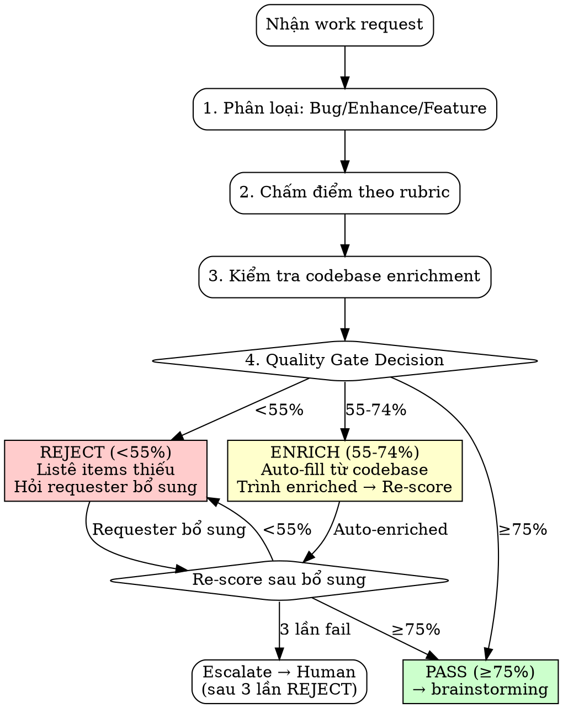

# Input Quality Gate — Unified cho Bug / Enhancement / New Feature

## ⚠️ QUY TẮC TUYỆT ĐỐI

- [ ] Skill này PHẢI chạy TRƯỚC ECC design (search-first/architect)
- [ ] Mọi work request (bug, enhance, feature) đều PHẢI qua gate
- [ ] KHÔNG rationalize skip: "request nhỏ/đơn giản" VẪN CẦN đánh giá
- [ ] Kết quả: REJECT (<55%) / ENRICH (55-74%) / PASS (≥75%)
- [ ] Sau REJECT: hỏi CỤ THỂ items thiếu → requester bổ sung → re-score
- [ ] Sau ENRICH: tự bổ sung từ codebase → trình enriched version → re-score
- [ ] Sau PASS: chuyển sang ECC design (search-first/architect) kèm quality report

## Process Flow



## BƯỚC 1: Phân loại request

Đọc request → xác định 1 trong 3 loại:

| Signal | Loại | Rubric áp dụng |
|--------|------|----------------|
| Lỗi, bug, error, crash, sai, không hoạt động | **BUG** | Bug Report Rubric |
| Cải thiện, thay đổi, update, thêm field/column | **ENHANCEMENT** | Enhancement PRD Rubric |
| Tính năng mới, module mới, integration mới | **NEW FEATURE** | Feature Request Rubric |

Nếu không rõ → hỏi 1 câu: "Đây là fix bug, cải thiện tính năng hiện có, hay tính năng hoàn toàn mới?"

## BƯỚC 2: Chấm điểm theo rubric

### 2A. Bug Report Rubric (100 điểm)

| # | Dimension | Điểm | Critical? | Mô tả |
|---|-----------|------|-----------|-------|
| 1 | Steps to Reproduce (S2R) | 25 | ✅ CRITICAL | Bước tái tạo cụ thể, có thể follow được |
| 2 | Observed Behavior (OB) | 20 | ✅ CRITICAL | Mô tả rõ CÁI GÌ xảy ra (error message, kết quả sai) |
| 3 | Expected Behavior (EB) | 15 | ✅ CRITICAL | Mô tả CÁI GÌ ĐÚNG RA phải xảy ra |
| 4 | Affected Module / Component | 10 | Enrichable | Module nào trong 21 modules LAMB |
| 5 | Error Logs / Stack Traces | 10 | Enrichable | Log lỗi, exception trace |
| 6 | Environment / Version | 5 | Enrichable | Env (dev/staging/prod), version |
| 7 | Severity Assessment | 5 | Enrichable | CRITICAL-PATH / HIGH-RISK / MEDIUM / LOW |
| 8 | Data Scenario | 5 | Enrichable | Dữ liệu cụ thể trigger bug (nếu có) |
| 9 | Screenshots / Evidence | 5 | Optional | Hình ảnh, video nếu UI bug |

**CRITICAL rule:** Nếu S2R=0 VÀ OB=0 → AUTO REJECT bất kể tổng điểm.

### 2B. Enhancement PRD Rubric (100 điểm)

| # | Dimension | Điểm | Critical? | Mô tả |
|---|-----------|------|-----------|-------|
| 1 | Problem Statement | 15 | ✅ CRITICAL | TẠI SAO cần thay đổi — business reason |
| 2 | Acceptance Criteria | 15 | ✅ CRITICAL | Given/When/Then hoặc checklist cụ thể |
| 3 | Affected Modules | 10 | ✅ CRITICAL | Module(s) nào bị ảnh hưởng |
| 4 | Current vs. Desired Behavior | 10 | Enrichable | Hiện tại ra sao, muốn thay đổi gì |
| 5 | Edge Cases | 10 | Enrichable | Trường hợp biên, error paths |
| 6 | Scope Boundaries | 10 | Enrichable | Trong scope / ngoài scope |
| 7 | Integration Points | 10 | Enrichable | APIs, services, modules liên quan |
| 8 | Rollback Plan | 5 | Enrichable | Nếu deploy fail → rollback thế nào |
| 9 | NFRs (Performance, Security) | 5 | Enrichable | Yêu cầu phi chức năng |
| 10 | User Story Format | 5 | Optional | As a... I want... So that... |
| 11 | Priority / Timeline | 5 | Optional | Urgency, deadline nếu có |

**CRITICAL rule:** Nếu Problem Statement=0 VÀ Acceptance Criteria=0 → AUTO REJECT.

### 2C. New Feature Request Rubric (100 điểm)

| # | Dimension | Điểm | Critical? | Mô tả |
|---|-----------|------|-----------|-------|
| 1 | Business Context | 15 | ✅ CRITICAL | TẠI SAO cần feature — business value |
| 2 | User Journeys | 15 | ✅ CRITICAL | Actor → hành động → kết quả (≥1 journey) |
| 3 | Success Criteria | 10 | ✅ CRITICAL | Đo lường thế nào = thành công |
| 4 | Scope Boundaries | 10 | ✅ CRITICAL | In-scope / Out-of-scope rõ ràng |
| 5 | Acceptance Criteria | 10 | Enrichable | Given/When/Then per journey |
| 6 | Dependencies | 10 | Enrichable | Modules/systems/APIs phụ thuộc |
| 7 | NFRs | 5 | Enrichable | Performance, security, scalability targets |
| 8 | Phase Sequencing | 5 | Enrichable | Phases có dependency order không |
| 9 | Edge Cases | 5 | Enrichable | Error paths, boundary conditions |
| 10 | Domain Model Impact | 5 | Enrichable | Entities, events mới cần tạo |
| 11 | UI/UX Requirements | 5 | Optional | Wireframes, mockups nếu có |
| 12 | Data Migration | 5 | Optional | Cần migrate data không |

**CRITICAL rule:** Nếu Business Context=0 VÀ User Journeys=0 → AUTO REJECT.

## BƯỚC 3: Codebase Enrichment (cho items "Enrichable")

Khi dimension có điểm = 0 nhưng KHÔNG critical, thử enrich từ codebase:

### 3.1 Module Identification
```bash
# Tìm module từ domain terms trong request
grep -rl "{keyword}" --include="*.java" -l | head -20
# Xác định module từ path: module-salary/src/...
```

### 3.2 Recent Changes
```bash
# Tìm thay đổi gần đây liên quan
git log --since="2 weeks" --oneline -- "module-{name}/"
```

### 3.3 Error Patterns
```bash
# Tìm error codes/exceptions liên quan
grep -rn "{error_keyword}" docs/architecture/{module}/error-handling.md
```

### 3.4 Test Coverage
```bash
# Tìm tests hiện có
find module-{name}/src/test -name "*{keyword}*Test.java"
```

### 3.5 API Contracts
```bash
# Tìm API endpoints liên quan
grep -rn "{endpoint_keyword}" docs/architecture/{module}/api-reference.md
```

### 3.6 Configuration
```bash
# Tìm config liên quan
grep -rn "{config_keyword}" docs/architecture/{module}/configuration.md
```

Sau enrichment: cộng điểm cho dimensions đã enriched → tính lại tổng.

## BƯỚC 4: Quality Gate Decision

| Tổng điểm | Quyết định | Hành động |
|-----------|-----------|----------|
| **≥75%** | ✅ PASS | Xuất Quality Report → chuyển sang ECC design (search-first/architect) |
| **55-74%** | ⚠️ ENRICH | Auto-enrich → trình enriched version → re-score |
| **<55%** | ❌ REJECT | Liệt kê CHÍNH XÁC items thiếu → hỏi requester bổ sung |

### Escalation rule
- Sau 3 lần REJECT liên tiếp → escalate cho Human Lead review
- Sau 2 lần ENRICH mà vẫn <75% → chuyển sang REJECT

## BƯỚC 5: Xuất Quality Report

Format output BẮT BUỘC:

```markdown
## 📋 Input Quality Report

**Request:** {Tên/ID request}
**Loại:** {BUG / ENHANCEMENT / NEW FEATURE}
**Điểm:** {score}/100
**Quyết định:** {✅ PASS / ⚠️ ENRICH / ❌ REJECT}

### Breakdown

| Dimension | Điểm | Max | Status |
|-----------|------|-----|--------|
| {dim 1} | {x} | {max} | ✅/⚠️/❌ |
| ... | | | |

### Enriched Items (nếu có)
- {Dimension}: {Giá trị enriched từ codebase}

### Missing Items (nếu REJECT)
- [ ] {Item 1 cần bổ sung — MÔ TẢ CỤ THỂ cần gì}
- [ ] {Item 2}

### Recommendation
{Gợi ý cải thiện hoặc next step}
```

## ANTI-PATTERNS (KHÔNG được làm)

| Rationalization | Tại sao SAI | Phải làm gì |
|----------------|-------------|-------------|
| "Request đơn giản, skip gate" | Bug đơn giản thường thiếu S2R → fix sai module | VẪN chạy gate, có thể fast-track nếu ≥90% |
| "Team đã hiểu context rồi" | AI Agent KHÔNG có tribal knowledge | Phải có documented context |
| "Urgent, không có thời gian" | Urgent + thiếu info = fix sai = tốn thời gian hơn | Fast-track score, KHÔNG skip |
| "Enhancement nhỏ, 1 dòng code" | 1 dòng code sai module = 31 module risk | Vẫn cần module ID + acceptance criteria |

## CHUYỂN TIẾP sang ECC

Khi PASS:
```
→ ECC design: search-first skill + architect agent
   Context: Enriched request + Quality Report
   Note: Input đã validate ≥75%, AI Agent có thể tin tưởng context
```

Khi dùng với OpenSpec:
```
→ Request PASS
→ /opsx:propose {name} — reference Quality Report
→ ECC design (search-first/architect) refine
→ /ecc:plan decompose + ECC execute (delegation + /ecc:tdd)
```
