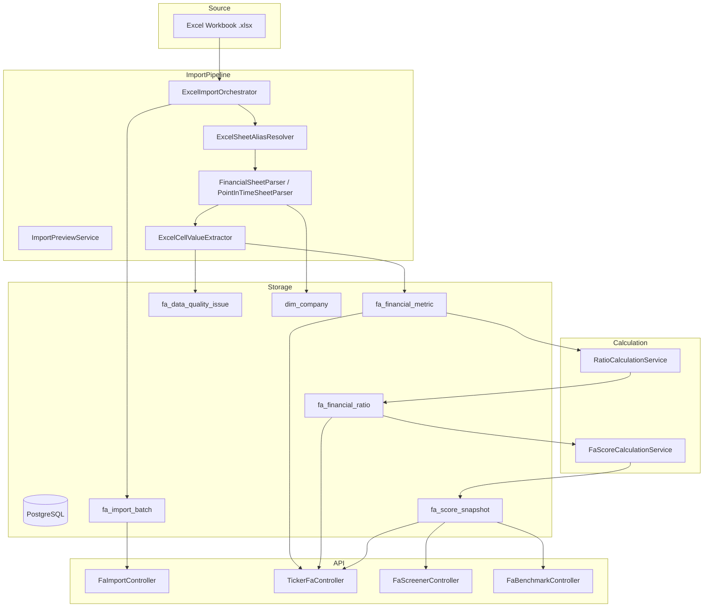

# Architecture — fundamental-engine

## 1. Vị trí trong hệ sinh thái

```
Marketing:
  eyelanding            → Next.js marketing + docs

Clients:
  eyeapp-frontend       → React + Vite SPA
  eyeapp-mobile         → Expo / React Native

Backend (BFF):
  eyeapp-backend        → Go API, auth, aggregation

Engines:
  eybroker              → Technical signals & positions
  fundamental-engine    → FA data, ratios, scores  ← THIS SERVICE
  recommendation-composer (planned) → Combined FA + TA signals
```

**fundamental-engine là upstream engine.** Frontend/mobile KHÔNG gọi trực tiếp. Luồng là:

```
Client → eyeapp-backend → fundamental-engine
```

---

## 2. Luồng dữ liệu tổng thể



---

## 3. Package Layout

```
com.eyelanding.fundamentalengine
├── FundamentalEngineApplication.java
│
├── api/                                   ← HTTP layer (thin)
│   ├── controller/
│   │   ├── FaImportController.java
│   │   ├── TickerFaController.java
│   │   ├── FaScreenerController.java
│   │   └── FaBenchmarkController.java
│   └── dto/
│       ├── ImportBatchResponse.java
│       ├── ImportPreviewResponse.java
│       ├── QualityReportResponse.java
│       ├── ScreenerResponse.java
│       ├── TickerOverviewResponse.java
│       ├── TickerFinancialsResponse.java
│       ├── TickerRatiosResponse.java
│       └── TickerScoreHistoryResponse.java
│
├── application/                           ← Business logic
│   ├── importbatch/
│   │   ├── ExcelImportOrchestrator.java   ← Entry point cho import
│   │   ├── ImportBatchQueryService.java
│   │   └── ImportPreviewService.java
│   ├── ticker/
│   │   └── TickerFaQueryService.java
│   ├── screener/
│   │   └── FaScreenerService.java
│   ├── ratio/
│   │   └── RatioCalculationService.java
│   └── score/
│       └── FaScoreCalculationService.java
│
├── domain/                                ← Domain enums & value objects
│   ├── MetricCode.java
│   ├── RatioCode.java
│   ├── PeriodType.java
│   ├── QualityStatus.java
│   ├── ImportStatus.java
│   └── SectorModel.java
│
└── infrastructure/
    ├── excel/                             ← Excel parsing
    │   ├── ExcelWorkbookReader.java
    │   ├── ExcelSheetAliasResolver.java
    │   ├── FinancialSheetParser.java      ← QUARTER / YEAR sheets
    │   ├── PointInTimeSheetParser.java    ← PRICE / PB sheets
    │   ├── FilterSheetParser.java         ← COMPANY_LIST sheet
    │   ├── ExcelCellValueExtractor.java
    │   └── LogicalSheet.java
    └── persistence/
        ├── entity/
        │   ├── FaCompanyEntity.java
        │   ├── FaImportBatchEntity.java
        │   ├── FaRawCellEntity.java
        │   ├── FaFinancialMetricEntity.java
        │   ├── FaFinancialRatioEntity.java
        │   ├── FaScoreSnapshotEntity.java
        │   └── FaDataQualityIssueEntity.java
        └── repository/
            ├── FaCompanyRepository.java
            ├── FaImportBatchRepository.java
            ├── FaFinancialMetricRepository.java
            ├── FaFinancialRatioRepository.java
            ├── FaScoreSnapshotRepository.java
            └── FaDataQualityIssueRepository.java
```

---

## 4. Layering Rules

| Layer | Được làm | Không được làm |
|---|---|---|
| `controller` | Nhận request, parse param, trả response | Viết business logic |
| `application` | Business flow, orchestration | Truy cập HTTP, trực tiếp dùng entity |
| `domain` | Enum, value object | Dependency với framework |
| `infrastructure/excel` | Parse file Excel | Gọi DB |
| `infrastructure/persistence` | Truy vấn DB | Viết business rule |

---

## 5. Tech Stack

| Thành phần | Công nghệ |
|---|---|
| Framework | Spring Boot 3.x |
| Language | Java 22 |
| Build | Maven |
| Database | PostgreSQL 15 |
| Migration | Liquibase |
| ORM | Spring Data JPA + Hibernate |
| Excel parsing | Apache POI |
| API docs | springdoc-openapi (Swagger UI tại `/swagger-ui.html`) |
| Cache | Redis (localhost:6379) |
| Observability | Actuator (`/actuator/health`) |

---

## 6. Configuration

| Property | Giá trị mặc định |
|---|---|
| Server port | `8088` |
| Actuator port | `8081` |
| DB URL | `jdbc:postgresql://localhost:5432/fundamental-engine` |
| DB user | `admin` |
| Redis host | `localhost:6379` |
| Max upload size | `50MB` |
