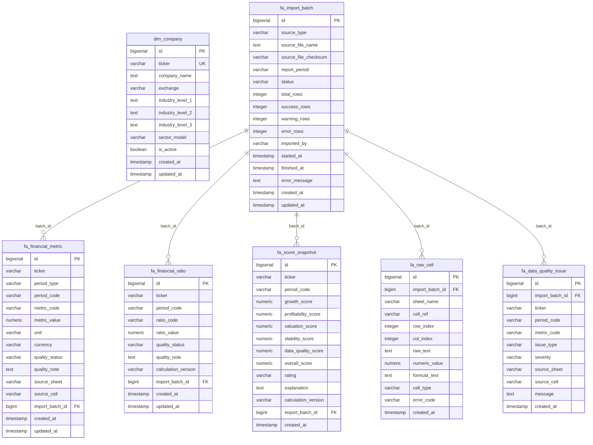

# Database Schema — fundamental-engine

## Overview

- **Database**: PostgreSQL 15
- **Migration tool**: Liquibase
- **Changelog entry**: `src/main/resources/db/changelog/db.changelog-master.yaml`
- **Schema**: `public` (tables prefixed `fa_` hoặc `dim_`)

---

## Entity Relationship Diagram

---

## Bảng chi tiết

### `dim_company` — Thông tin công ty

| Column | Type | Description |
|---|---|---|
| `id` | bigserial PK | |
| `ticker` | varchar(20) UNIQUE | Mã cổ phiếu, e.g. `HPG`, `MWG` |
| `company_name` | text | Tên đầy đủ |
| `exchange` | varchar(20) | `HOSE` / `HNX` / `UPCOM` |
| `industry_level_1` | text | Ngành cấp 1 (ICB) |
| `industry_level_2` | text | Ngành cấp 2 |
| `industry_level_3` | text | Ngành cấp 3 |
| `sector_model` | varchar(30) | `GENERAL` / `BANK` / `SECURITIES` / `INSURANCE` / `REAL_ESTATE` / `UNKNOWN` |
| `is_active` | boolean | Cổ phiếu còn giao dịch không |

**Indexes**: `exchange`, `sector_model`

---

### `fa_import_batch` — Theo dõi mỗi lần import

| Column | Type | Description |
|---|---|---|
| `id` | bigserial PK | |
| `source_type` | varchar(50) | `EXCEL_UPLOAD` |
| `source_file_name` | text | Tên file gốc |
| `source_file_checksum` | varchar(128) | SHA-256 của file |
| `report_period` | varchar(20) | e.g. `2026Q1` |
| `status` | varchar(30) | `PENDING` / `PROCESSING` / `SUCCESS` / `PARTIAL_SUCCESS` / `FAILED` |
| `total_rows` | integer | Tổng dòng phân tích |
| `success_rows` | integer | Dòng import thành công |
| `warning_rows` | integer | Dòng có cảnh báo |
| `error_rows` | integer | Dòng lỗi |
| `imported_by` | varchar(100) | User thực hiện import |
| `started_at` | timestamp | |
| `finished_at` | timestamp | |
| `error_message` | text | Lỗi nghiêm trọng nếu có |

**Indexes**: `status`, `source_file_checksum`, `report_period`

---

### `fa_financial_metric` — Fact table chỉ số tài chính raw

> Đây là bảng trung tâm. Thiết kế EAV generic — chỉ cần mở rộng `MetricCode` enum để thêm dữ liệu mới, không cần thay đổi schema.

| Column | Type | Description |
|---|---|---|
| `ticker` | varchar(20) | Mã cổ phiếu |
| `period_type` | varchar(30) | `QUARTER` / `YEAR` / `POINT_IN_TIME` |
| `period_code` | varchar(20) | e.g. `2026Q1`, `2025`, `2026-05-30` |
| `metric_code` | varchar(50) | Xem enum `MetricCode` bên dưới |
| `metric_value` | numeric(30,6) | Giá trị (đơn vị theo `unit`) |
| `unit` | varchar(30) | `VND_BILLION` / `VND` / `SHARE` / `RATIO` |
| `currency` | varchar(10) | `VND` |
| `quality_status` | varchar(30) | `OK` / `MISSING` / `FORMULA_ERROR` / `SUSPICIOUS` / `NOT_REPORTED` / `NOT_APPLICABLE` |
| `quality_note` | text | Ghi chú về chất lượng |
| `source_sheet` | varchar(200) | Tên sheet trong Excel |
| `source_cell` | varchar(30) | Địa chỉ cell, e.g. `C5` |
| `import_batch_id` | bigint FK | |

**Unique constraint**: `(ticker, period_type, period_code, metric_code, import_batch_id)`

**Indexes**: `(ticker, period_code)`, `(metric_code, period_code)`, `import_batch_id`, `quality_status`

#### MetricCode enum (Phase 1)

| Code | Sheet nguồn | Period type | Đơn vị |
|---|---|---|---|
| `REVENUE` | `REVENUE` | `QUARTER` | VND tỷ |
| `NPAT` | `NPAT` | `QUARTER` | VND tỷ |
| `GROSS_PROFIT` | `GROSS_PROFIT` | `QUARTER` | VND tỷ |
| `NPAT_YEARLY` | `NPAT_YEARLY` | `YEAR` | VND tỷ |
| `EPS_DILUTED` | `EPS_DILUTED` | `QUARTER` / `TTM` | VND |
| `SHARES_OUTSTANDING` | `SHARES_OUTSTANDING` | `POINT_IN_TIME` | cổ phiếu |
| `CLOSE_PRICE` | `STOCK_PRICE` | `POINT_IN_TIME` | VND |
| `PB` | `PB` | `POINT_IN_TIME` | ratio |

---

### `fa_financial_ratio` — Tỷ số tài chính đã tính

| Column | Type | Description |
|---|---|---|
| `ticker` | varchar(20) | |
| `period_code` | varchar(20) | |
| `ratio_code` | varchar(50) | Xem enum `RatioCode` bên dưới |
| `ratio_value` | numeric(30,8) | |
| `quality_status` | varchar(30) | |
| `calculation_version` | varchar(50) | e.g. `v1.0` — versioned để tính lại |
| `import_batch_id` | bigint FK | |

**Unique constraint**: `(ticker, period_code, ratio_code, calculation_version, import_batch_id)`

#### RatioCode enum (Phase 1)

| Code | Công thức | Ý nghĩa |
|---|---|---|
| `REVENUE_YOY` | (Rev_Q - Rev_Q-4) / Rev_Q-4 × 100 | Tăng trưởng DT năm |
| `NPAT_YOY` | (NPAT_Q - NPAT_Q-4) / NPAT_Q-4 × 100 | Tăng trưởng LN năm |
| `REVENUE_QOQ` | (Rev_Q - Rev_Q-1) / Rev_Q-1 × 100 | Tăng trưởng DT quý |
| `NPAT_QOQ` | (NPAT_Q - NPAT_Q-1) / NPAT_Q-1 × 100 | Tăng trưởng LN quý |
| `GROSS_MARGIN` | Gross Profit / Revenue × 100 | Biên lợi nhuận gộp (%) |
| `NET_MARGIN` | NPAT / Revenue × 100 | Biên lợi nhuận ròng (%) |
| `MARKET_CAP` | Price × Shares Outstanding | Vốn hóa thị trường (VND) |
| `EPS_TTM` | Tổng EPS 4 quý gần nhất | EPS trailing 12 months |
| `PE_TTM` | Price / EPS_TTM | Định giá P/E |
| `PB` | Từ sheet PB | Định giá P/B |
| `POSITIVE_NPAT_LAST_4Q` | 1 nếu 4Q gần nhất đều dương | Lợi nhuận bền vững |
| `PROFIT_TURNAROUND_FLAG` | Đang lỗ → có lãi | Turnaround |

---

### `fa_score_snapshot` — Điểm FA tổng hợp

| Column | Type | Description |
|---|---|---|
| `ticker` | varchar(20) | |
| `period_code` | varchar(20) | |
| `growth_score` | numeric(10,2) | Max 30đ |
| `profitability_score` | numeric(10,2) | Max 25đ |
| `valuation_score` | numeric(10,2) | Max 25đ |
| `stability_score` | numeric(10,2) | Max 10đ |
| `data_quality_score` | numeric(10,2) | Max 10đ |
| `overall_score` | numeric(10,2) | Tổng max 100đ |
| `rating` | varchar(30) | `STRONG_FA` / `GOOD_FA` / `FAIR_FA` / `WEAK_FA` / `POOR_FA` |
| `explanation` | text | Tóm tắt lý do điểm |
| `calculation_version` | varchar(50) | `v1.0` |
| `import_batch_id` | bigint FK | |

**Rating thresholds**: ≥80 STRONG | ≥65 GOOD | ≥50 FAIR | ≥35 WEAK | <35 POOR

**Indexes**: `(ticker, period_code)`, `(period_code, overall_score DESC)`, `(period_code, rating)`

---

### `fa_data_quality_issue` — Vấn đề chất lượng dữ liệu

| Column | Type | Description |
|---|---|---|
| `import_batch_id` | bigint FK | |
| `ticker` | varchar(20) | Nullable (batch-level issue) |
| `period_code` | varchar(20) | |
| `metric_code` | varchar(50) | |
| `issue_type` | varchar(50) | `MISSING` / `FORMULA_ERROR` / `SUSPICIOUS` / ... |
| `severity` | varchar(20) | `ERROR` / `WARN` / `INFO` |
| `source_sheet` | varchar(200) | Sheet phát sinh lỗi |
| `source_cell` | varchar(30) | Cell phát sinh lỗi |
| `message` | text | Mô tả chi tiết |

---

### `fa_raw_cell` — Raw cell data (debugging)

> Bảng phụ, chỉ lưu khi debug. Có thể bị phình lớn.

| Column | Type | Description |
|---|---|---|
| `import_batch_id` | bigint FK | |
| `sheet_name` | varchar(200) | |
| `cell_ref` | varchar(30) | e.g. `C15` |
| `row_index` | integer | 0-indexed |
| `col_index` | integer | 0-indexed |
| `raw_text` | text | toString() của cell |
| `numeric_value` | numeric(30,6) | Nếu cell là số |
| `formula_text` | text | Nếu cell là formula |
| `cell_type` | varchar(30) | `NUMERIC` / `STRING` / `FORMULA` / `BLANK` / `ERROR` |
| `error_code` | varchar(50) | `#DIV/0!` / `#N/A` / `#REF!` |

---

## Nguyên tắc thiết kế

1. **Không xóa batch cũ** — Mỗi import tạo 1 batch mới. Read API default là batch SUCCESS mới nhất.
2. **Không overwrite metric cũ** — UNIQUE constraint bao gồm `import_batch_id`, nên mỗi batch là một snapshot độc lập.
3. **Không silent convert lỗi thành 0** — Các cell lỗi được đánh dấu `quality_status = FORMULA_ERROR`.
4. **MetricCode là extensible** — Thêm metric mới chỉ cần thêm enum value, không migration DB.
5. **Calculation versioning** — `calculation_version` ở ratio và score cho phép chạy lại tính toán với logic mới mà không mất data cũ.
