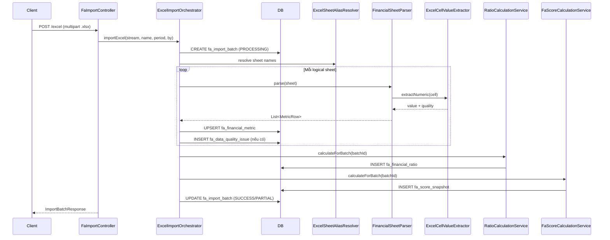

# Feature: Excel Import

## Mục đích

Import workbook Excel chứa dữ liệu tài chính của các công ty niêm yết Việt Nam vào database dưới dạng structured metrics.

## Luồng xử lý

```
POST /excel/preview  →  Validate workbook  →  Trả preview (không lưu)
POST /excel          →  Full import pipeline
```



## Sheet Mapping

Workbook Excel có nhiều sheet. Hệ thống resolve theo alias (normalize accents, case):

| Logical Sheet | Alias chấp nhận | Parser | Period type |
|---|---|---|---|
| `COMPANY_LIST` | `Tất cả CP`, `Tat ca CP`, `All Stocks` | `FilterSheetParser` | — |
| `REVENUE` | `Doanh thu` | `FinancialSheetParser` | `QUARTER` |
| `NPAT` | `LNST` | `FinancialSheetParser` | `QUARTER` |
| `GROSS_PROFIT` | `LNG` | `FinancialSheetParser` | `QUARTER` |
| `NPAT_YEARLY` | `LNST năm`, `LNST nam` | `FinancialSheetParser` | `YEAR` |
| `EPS_DILUTED` | `EPS pha loãng`, `EPS pha loang` | `FinancialSheetParser` | `QUARTER` |
| `SHARES_OUTSTANDING` | `SLCP lưu hành`, `SLCP luu hanh` | `PointInTimeSheetParser` | `POINT_IN_TIME` |
| `STOCK_PRICE` | `GIÁ CP`, `GIA CP` | `PointInTimeSheetParser` | `POINT_IN_TIME` |
| `PB` | `P.B`, `PB` | `PointInTimeSheetParser` | `POINT_IN_TIME` |

## Parsing Rules

1. **Header detection**: Tìm hàng header bằng cách scan các cột chứa `Mã`, `Ticker`, `Code`.
2. **Period header**: Normalize `Q1.2026`, `Q1.26`, `2026Q1` → `2026Q1` (format chuẩn).
3. **Cell types**:
   - Numeric cell → đọc giá trị trực tiếp.
   - Formula cell → đọc cached result. Ghi chú nguồn là FORMULA.
   - Formula error (`#DIV/0!`, `#N/A`, `#REF!`) → `quality_status = FORMULA_ERROR`, KHÔNG chuyển thành 0.
   - Blank cell → `quality_status = MISSING`.
4. **String numeric** (e.g. `"28,500"`) → parse có xử lý dấu phẩy nghìn.

## Data Quality

Mọi cell đều được đánh giá:

| Quality Status | Ý nghĩa |
|---|---|
| `OK` | Giá trị hợp lệ |
| `MISSING` | Cell trống |
| `NOT_REPORTED` | Công ty không báo cáo (chủ động để trống) |
| `NOT_APPLICABLE` | Chỉ số không áp dụng cho ngành này |
| `FORMULA_ERROR` | Cell chứa lỗi công thức Excel |
| `SUSPICIOUS` | Giá trị bất thường (negative khi không nên, outlier) |
| `ESTIMATED` | Giá trị được ước tính, không phải báo cáo chính thức |

## Import Batch States

```
PENDING → PROCESSING → SUCCESS
                     → PARTIAL_SUCCESS  (có lỗi nhưng import được phần lớn)
                     → FAILED           (lỗi nghiêm trọng)
```

## Business Rules

- Cùng file (checksum) có thể import lại trong dev. Production nên check duplicate.
- Mỗi import tạo 1 batch mới, KHÔNG overwrite batch cũ.
- Read API default là batch SUCCESS mới nhất.
- Nếu import fail giữa chừng → batch trạng thái `PARTIAL_SUCCESS`, vẫn expose quality report.
